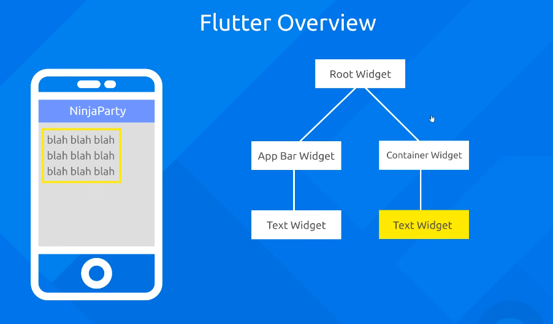

# Widgets in Flutter


- [Flutter Widget Docs](https://docs.flutter.dev/ui/widgets)

Everything in Flutter is a widget. 
A widget is a piece of UI that can be composed of other widgets to create a complex UI.




```dart
import 'package:flutter/material.dart';

void main() {
  runApp(const MyApp());
}

class MyApp extends StatelessWidget {
  const MyApp({Key? key}) : super(key: key);

  @override
  Widget build(BuildContext context) {
    return MaterialApp(
      debugShowCheckedModeBanner: false,
      home: const NinjaPartyScreen(),
    );
  }
}

class NinjaPartyScreen extends StatelessWidget {
  const NinjaPartyScreen({Key? key}) : super(key: key);

  @override
  Widget build(BuildContext context) {
    // 1. Root Widget: The Scaffold acts as the base structure for the screen
    return Scaffold(
      backgroundColor: Colors.grey[300], // Matching the grey background from the image
      
      // 2. App Bar Widget Branch
      appBar: AppBar(
        backgroundColor: Colors.indigo[400], 
        // Text Widget inside the App Bar
        title: const Text('NinjaParty'),
        elevation: 0,
      ),
      
      // 3. Container Widget Branch
      body: Padding(
        padding: const EdgeInsets.all(16.0),
        child: Align(
          alignment: Alignment.topLeft,
          // Container Widget
          child: Container(
            padding: const EdgeInsets.all(8.0),
            // The yellow border corresponds to the highlighted box in the UI mockup
            decoration: BoxDecoration(
              border: Border.all(color: Colors.yellowAccent, width: 3),
            ),
            // Text Widget inside the Container
            child: const Text(
              'blah blah blah\nblah blah blah\nblah blah blah',
              style: TextStyle(
                fontSize: 16,
                color: Colors.black54,
              ),
            ),
          ),
        ),
      ),
    );
  }
}
```

As shown above, we have a root widget at the top of widget tree, inside that we have other widgets.


Some of the widgets we have are:

- **TextWidget** : Used to display text.
- **ContainerWidget** : Used to display a container.
- **ImageWidget** : Used to display an image.
- **ButtonWidget** : Used to display a button.
- **ListViewWidget** : Used to display a list.
- **GridViewWidget** : Used to display a grid.


# Types of Widgets

Widgets are broadly of two types:

1. StatelessWidget
2. StatefulWidget

## StatelessWidget

A StatelessWidget is a widget that is immutable and cannot be changed. 
It is a stateless widget that is used to display a static UI.

Example:
```dart
import 'package:flutter/material.dart';

void main() {
  runApp(MyApp());
}

class MyApp extends StatelessWidget {
  @override
  Widget build(BuildContext context) {
    return MaterialApp(
      home: Scaffold(
        appBar: AppBar(title: Text('Stateless Widget')),
        body: Center(child: Text('Hello, World!')),
      ),
    );
  }
}
```

