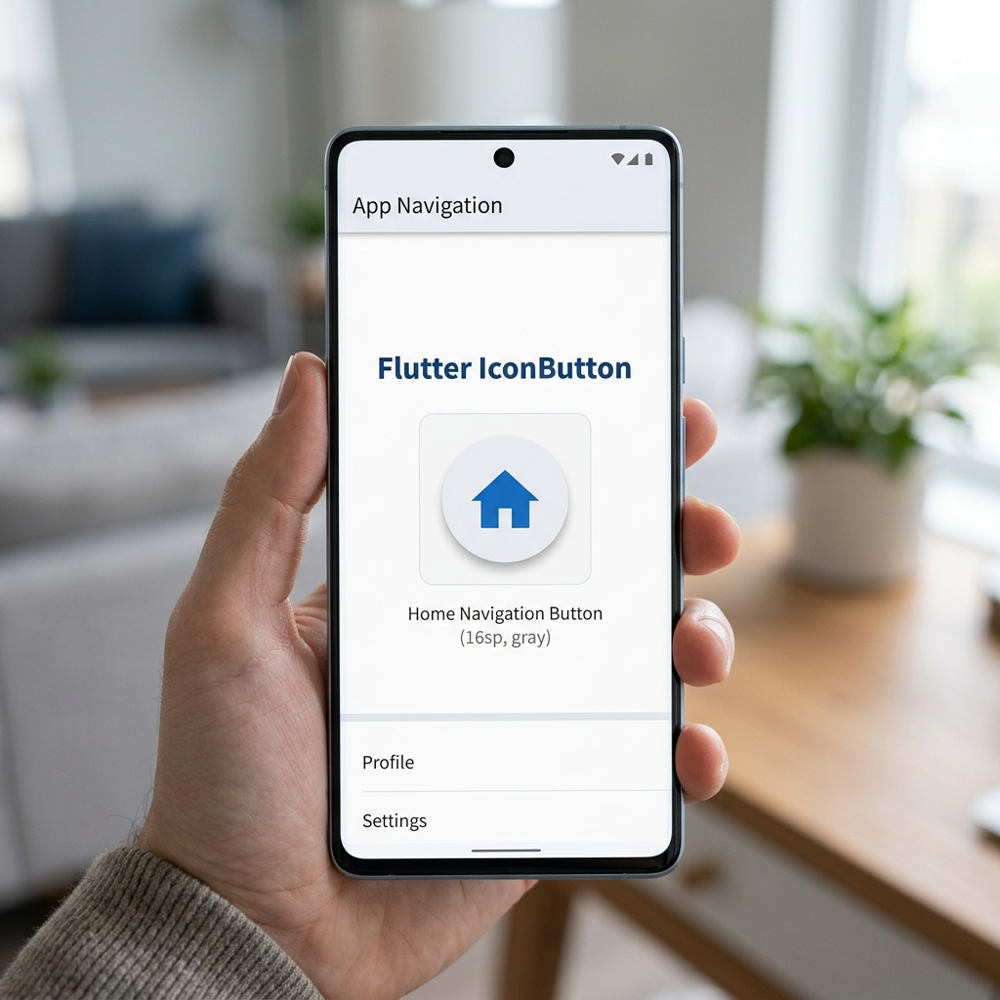
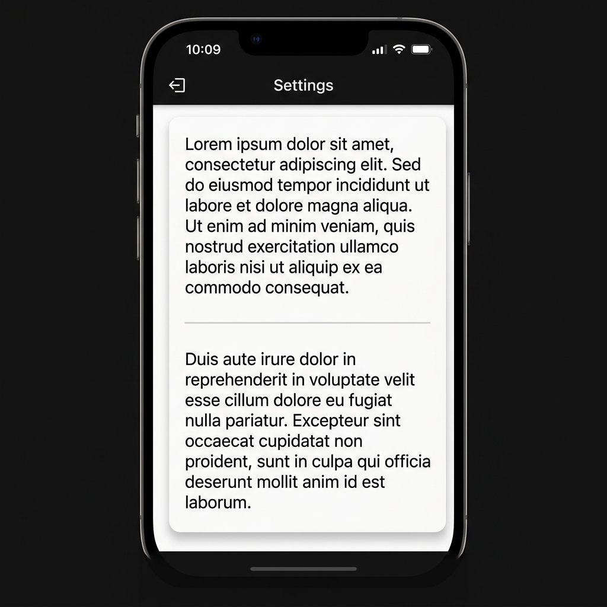
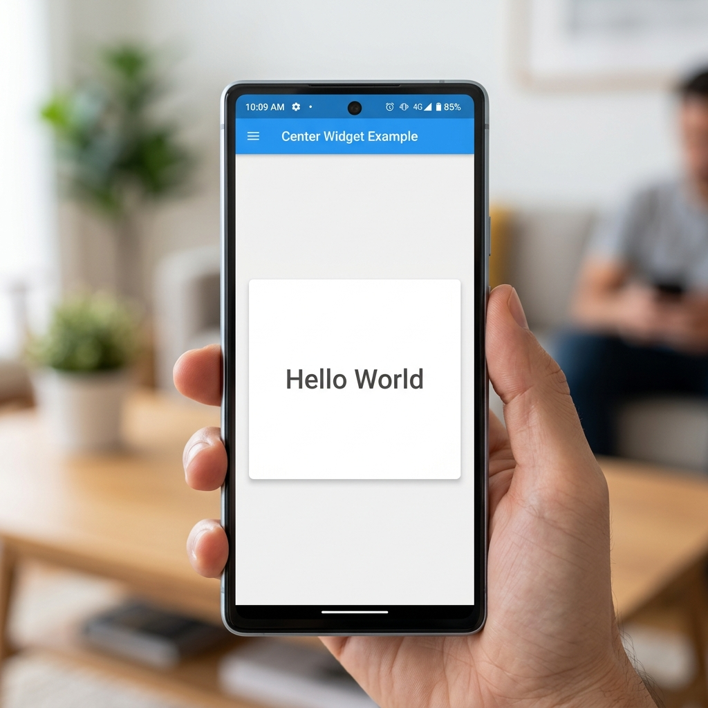
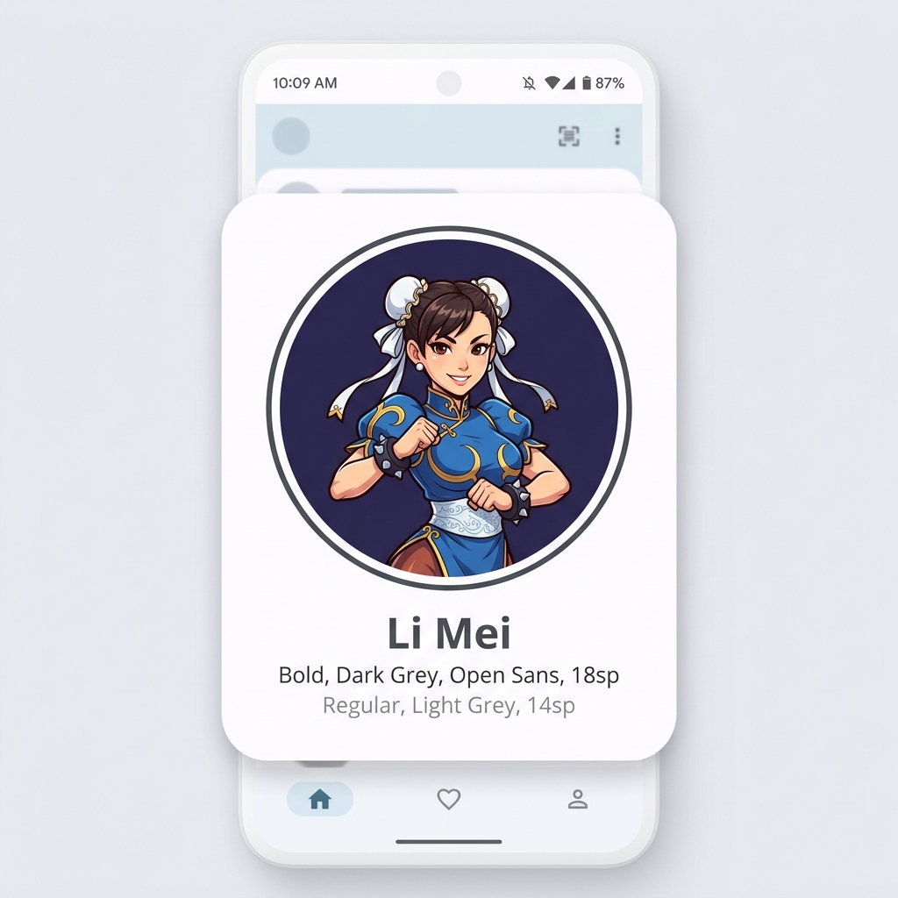
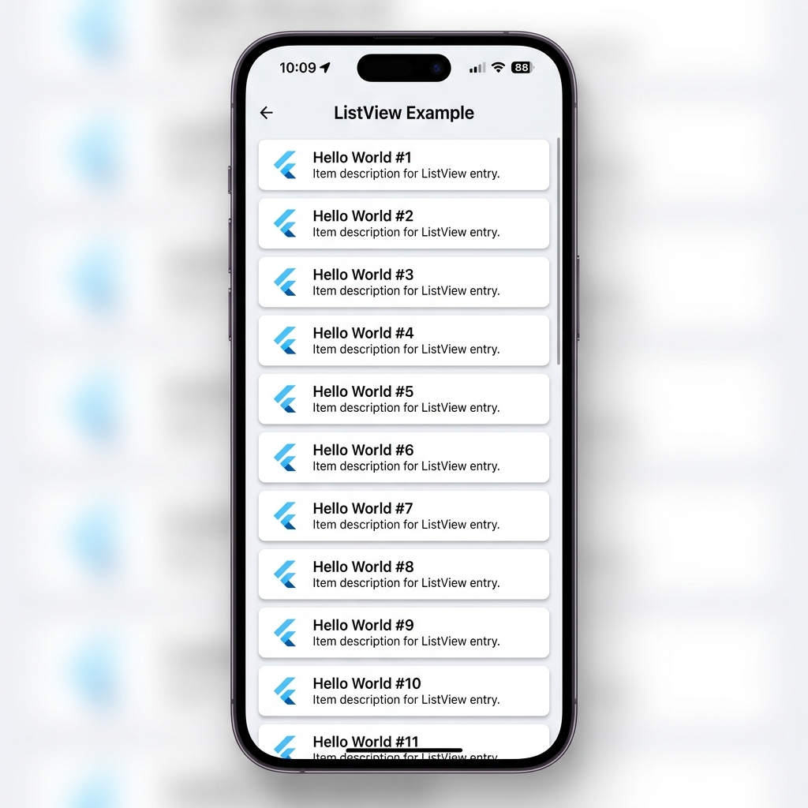
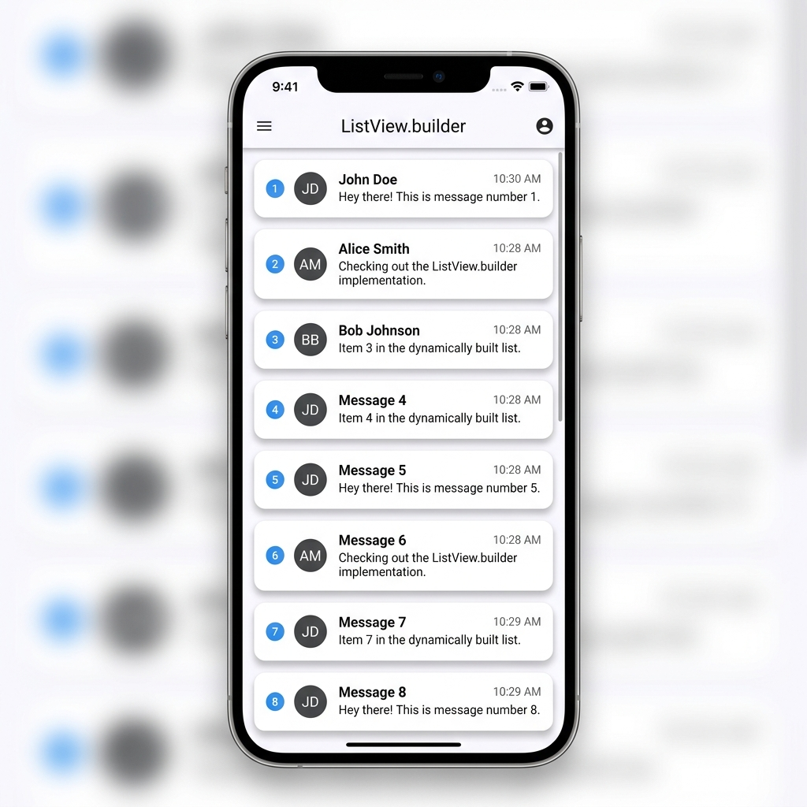
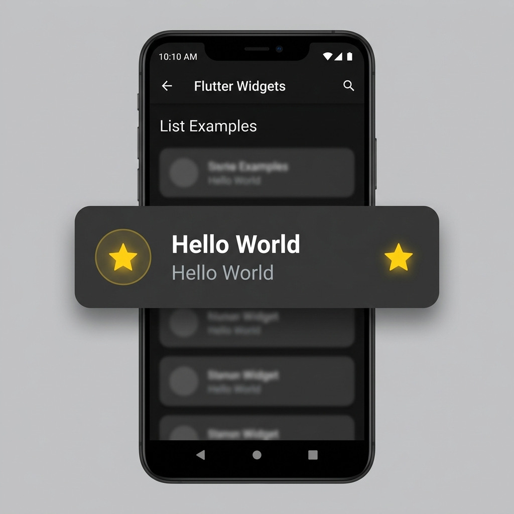

# Some Useful Widgets:

[Widget Catalog](https://docs.flutter.dev/ui/widgets/material)


## 1. Image Widget:


**Image From URL:**

```dart
Image(
    image: NetworkImage('https://encrypted-tbn0.gstatic.com/images?q=tbn:ANd9GcRF98sbQeNeSMz3nbGKwwnh4XyFU-ojyeNghA&s')
)
```

**Image From Asset:**

```dart
Image(
    image: AssetImage('assets/image.png')
)
```


To use a image from assets, image must be first defined in `pubspec.yaml` file.

```yml
assets:
  - assets/image.png
```

If there are multiple images:

```yml
assets:
  - assets/space-1.jpg
  - assets/space-2.jpg
  - assets/space-3.jpg
```

Or simply:

```yml
assets:
  - assets
```

## Icon Widget:

```dart
Icon(
    Icons.star, // use existing icons provided by flutter
    color: Colors.yellow,
    size: 50,
)
```


## Icon Button:

```dart
IconButton(onPressed: () => print("Pressed"), icon: Icon(Icons.home))
```




## Divider Widget:

Divider is used to draw a horizontal line between widgets.

```dart
Divider(color: Colors.grey[600], height: 60)
```




## Center Widget:

Center is used to center a widget.

```dart
Center(
    child: Text('Hello World'),
)
```



## CircleAvatar Widget:

CircleAvatar is used to display a circle avatar.

```dart
CircleAvatar(
    backgroundImage: AssetImage('assets/images/chun-li.jpg'),
    radius: 50,
)
```



## ListView Widget:

```dart
ListView(
    children: [
      Text('Hello World'),
      Text('Hello World'),
      Text('Hello World'),
    ],
)
```



## ListView.builder Widget:

```dart
ListView.builder(
    itemCount: 10,
    itemBuilder: (context, index) {
      return Text('Hello World');
    },
)
```



## Listtitle Widget:

```dart
ListTile(
    leading: Icon(Icons.star),
    title: Text('Hello World'),
    subtitle: Text('Hello World'),
    trailing: Icon(Icons.star),
)
```



Here, leading, title, subtitle and trailing are widget themselves.


## Visibility Widget:

- Use to controll the visibility with `visible` boolean parameter.

```dart
Visibility(
    visible: <true/false>, // boolean parameter
    child: Padding(
    padding: EdgeInsetsGeometry.all(10),
    child: Container(
        width: 100,
        height: 100,
        color: Colors.indigoAccent,
        child: Center(child: Text('Visibility Container'),),
    ),
    ),
);
```