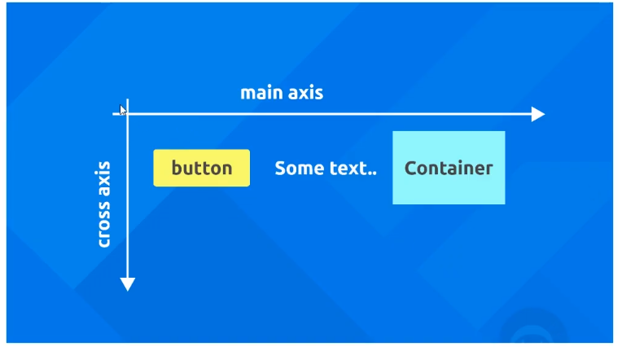

# Layout and Structuring:

## 1. Container Widget:

Flutter has a inbuilt **Container** Widget that can be used to give a structure to the UI.

```dart
Container(
    color: Colors.grey,
    child: Text('Hello')
),
```

Here, we have Text widget inside the container.

### Padding:

```dart
Container(
    color: Colors.grey,
    child: Text('Hello'),
    padding: EdgeInsets.all(20), // Adds 20px padding to all sides
),
```

Above code applies padding to all sides, however we can apply padding to specific sides.

**Padding to Specific Sides:**

```dart
Container(
    color: Colors.grey,
    child: Text('Hello'),
    padding: EdgeInsets.symmetric(horizontal: 20, vertical: 10), // Adds 20px padding to left and right, 10px padding to top and bottom
),
```

**Padding to individual sides:**

```dart
Container(
    color: Colors.grey,
    child: Text('Hello'),
    padding: EdgeInsets.only(
      left: 20,
      top: 20,
      right: 20,
      bottom: 20
    ),
)
```

### Margin:

```dart
Container(
    color: Colors.grey,
    child: Text('Hello'),
    margin: EdgeInsets.all(20), // Adds 20px margin to all sides
)
```

## 2. Row Widget:

```dart
      body: Row(
        children: [ // accepts a list of Widgets
          Text('Hello world'),
          TextButton(onPressed: () => {}, child: Text('Click Me')),
          Container(
            color: Colors.cyan,
            padding: EdgeInsets.all(30),
            child: Text('Hello world'),
          )
        ],
      ),
```

Alignment can be controlled with `mainAxisAlignment` and `crossAxisAlignment`.

**Main Axis** - Aligns the children along the main axis.

**Cross Axis** - Aligns the children along the cross axis.




```dart
      body: Row(
        mainAxisAlignment: MainAxisAlignment.center,
        crossAxisAlignment: CrossAxisAlignment.center,
        children: [ // accepts a list of widgets
          Text('Hello world'),
          TextButton(onPressed: () => {}, child: Text('Click Me')),
          Container(
            color: Colors.cyan,
            padding: EdgeInsets.all(30),
            child: Text('Hello world'),
          )
        ],
      ),
```

Options for `mainAxisAlignment`:

1. `start` - Aligns the children to the start of the main axis
2. `end` - Aligns the children to the end of the main axis
3. `center` - Aligns the children to the center of the main axis
4. `spaceAround` - Aligns the children with equal space around them
5. `spaceBetween` - Aligns the children with equal space between them
6. `spaceEvenly` - Aligns the children with equal space between them and at the ends


Options for `crossAxisAlignment`:

1. `start` - Aligns the children to the start of the cross axis
2. `end` - Aligns the children to the end of the cross axis
3. `center` - Aligns the children to the center of the cross axis
4. `stretch` - Stretches the children to fill the cross axis
5. `baseline` - Aligns the children along the baseline

## 3. Column Widget:


```dart
      body: Column(
        children: [
          Container(
            padding: EdgeInsets.all(10.0),
            color: Colors.cyan,
            child: Text('one')
          ),
          Container(
            padding: EdgeInsets.all(20.0),
            color: Colors.pinkAccent,
            child: Text('Two')
          ),
          Container(
            padding: EdgeInsets.all(30.0),
            color: Colors.amber,
            child: Text('Three')
          ),
        ]
      ),
```

Here, the **main axis** and **cross axis** are vertical and horizontal respectively.


## 5. Expanded Widget:

Expanded widget is a layout widget used to force a child to stretch and fill all the available remaining space within a **Row, Column, or Flex**.


```dart
      body: Row(
        children: [
          Expanded(
            // flex: <>
            child: Container(
              padding: EdgeInsets.all(30),
              color: Colors.cyan,
              child: Text('one'),
            ),
          ),
          Expanded(
            //flex: <>,
            child: Container(
              padding: EdgeInsets.all(30),
              color: Colors.amber,
              child: Text('three'),
            ),
          )
        ],
      ),
```

> The **flex** property takes an integer. Flutter adds up all the flex values of the Expanded widgets, and then divides the available space according to those fractions.

> If Widget A has flex: 1 and Widget B has flex: 2, the total flex is 3.

> Widget A will take 1/3 of the remaining space.

Widget B will take 2/3 of the remaining space.
