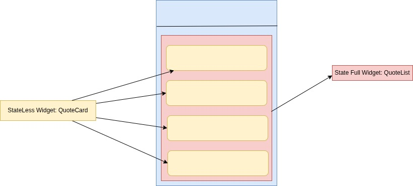

## Function As A Parameter:



We have a QuoteList as a stateful widget and QuoteCard as a stateless widget. 

We cannot access the methods in the stateful widget from the stateless widget directly. So, we need to pass a function as a parameter to the stateless widget to modify the data at the stateful widget.

For this we need to define a callback function in stateful widget and pass it to the stateless widget as a parameter.

Now, in the QuoteList widget, we have a method as below:

```dart
class QuoteList extends StatefulWidget {
  @override
  State<QuoteList> createState() => _QuoteList();
}

class _QuoteList extends State<QuoteList> {

  List<Quote> quotes = [
    .....
    ....
  ];


  // callback function passed to the child widget
  void deleteQuote(Quote quote){
    setState((){
      quotes.where((q) => q != quote).toList();
    });
  }

  
  @override
  Widget build(BuildContext context) {
    return Scaffold(
      ...
      body: Column(
        .....
        children: quotes.map((quote) {
            return QuoteCard(
              quote: quote,
              deleteQuote: deleteQuote // callback function passed
            );
        }).toList()
      )
    );
  }
}
```


Now we access the callback function that sets a state as below:

```dart
...
...

class QuoteCard extends StatelessWidget {

  // since we are using stateless widget, state defines should not change
  // final indicates that the state defines should not change.
  final Quote quote;

  
  // callback function passed from the parent widget
  final Function deleteQuote;

  // constructor to initialize the state
  QuoteCard({required this.quote, required this.deleteQuote});

  // widget builder
  @override
  Widget build(BuildContext context) {
    return Card(
      margin: EdgeInsets.fromLTRB(16, 16, 16, 0),
      child: Padding(
        ...
        child: Column(
            children: [
            ...
            ...
            TextButton.icon(
                onPressed: () => {deleteQuote(quote)}, // callback function that was passed from the parent widget 
                icon: Icon(Icons.delete),
                ... 
            )
            ],
        ),
      )
    );
  }
}
```
